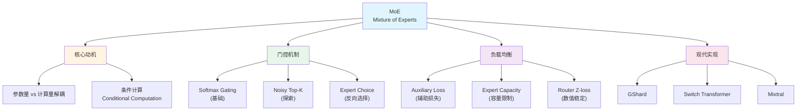

# MoE稀疏模型解析

> **一句话摘要**: 理解Mixture of Experts如何用1x计算量获得128x模型容量，掌握门控机制、负载均衡和训练稳定性的核心技术。

## 核心概念

### 关键术语
| 术语 | 定义 | 重要性 |
|------|------|--------|
| Sparse MoE | 稀疏激活的专家混合模型，每次只激活部分专家 | 大模型效率的关键 |
| Router/Gating | 决定token路由到哪些专家的网络 | MoE的核心组件 |
| Top-K | 每个token只选择K个专家处理 | 实现稀疏激活 |
| Auxiliary Loss | 辅助损失，用于平衡专家负载 | 防止专家坍塌 |
| Expert Capacity | 每个专家能处理的最大token数 | 保证计算均衡 |

### 概念图谱



## 技术深度

### 1. MoE的核心动机

**Dense模型的根本限制**:
```python
# Dense FFN: 参数量 = 计算量 (线性关系)
def dense_ffn(x):
    # d_model=4096, d_ff=16384
    h = W1 @ x  # 使用所有参数
    return W2 @ h

# 10倍容量 → 10倍参数 → 10倍计算 → 10倍成本！
```

**MoE的突破**:
```python
# MoE: 打破参数-计算的线性关系
def moe_ffn(x, num_experts=128, k=1):
    gates = router(x)  # 轻量级路由
    top_k = topk(gates, k)  # 只选k个专家

    output = 0
    for i in top_k:
        output += gates[i] * experts[i](x)  # 只计算k个专家
    return output

# 128倍参数 → 只需1倍计算！
```

**核心公式**:
$$
y = \sum_{i \in \text{TopK}(G(x))} G(x)_i \cdot E_i(x)
$$

### 2. 专家的本质

**结构上**: 专家就是普通FFN
```python
class Expert(nn.Module):
    def __init__(self, d_model, d_ff):
        self.w1 = nn.Linear(d_model, d_ff)
        self.w2 = nn.Linear(d_ff, d_model)

    def forward(self, x):
        return self.w2(F.gelu(self.w1(x)))

# 与Dense FFN结构完全相同！
```

**专业化来源**: 训练过程中自然形成
```
专家专业化的5大机制:

1. Router学习: 相似输入 → 相似专家
2. 梯度稀疏: 每个专家只从部分数据学习
3. 正反馈循环: 擅长某类 → 更多该类数据 → 更擅长
4. 容量限制: 专家被迫"拒绝"不擅长的数据
5. 损失信号: 主任务损失驱动差异化

研究发现的专业化模式:
- 语法专家: 处理句法结构
- 语义专家: 处理词汇意义
- 实体专家: 处理命名实体
- 数字专家: 处理数值计算
```

### 3. 参数量与计算量分析

**配置示例**:
```
d_model = 4096
d_ff = 16384
num_experts = 128
k = 2 (Top-2)
```

**参数量对比**:
```python
# Dense FFN
params_dense = 2 × d_model × d_ff
            = 2 × 4096 × 16384
            = 134M 参数

# MoE FFN
params_router = d_model × num_experts = 4096 × 128 = 0.5M
params_experts = 128 × 134M = 17.2B
params_total = 17.2B 参数

增加倍数: 17.2B / 134M ≈ 128倍！
```

**计算量对比**:
```python
# 对于一个token:
# Dense
flops_dense = 2 × 2 × d_model × d_ff = 268M FLOPs

# MoE (k=2)
flops_router = 2 × d_model × num_experts = 1M
flops_experts = 2 × 268M = 536M
flops_total = 537M FLOPs

计算增加: 537M / 268M ≈ 2倍 (因为k=2)
参数增加: 128倍
性价比: 128/2 = 64倍！
```

### 4. 门控机制详解

#### 4.1 基础Softmax门控的问题

```python
def softmax_gating(x, num_experts):
    logits = W_gate @ x  # [num_experts]
    gates = softmax(logits)
    return topk(gates, k)
```

**问题: 赢者通吃 (Winner-Take-All)**
```
训练初期:
专家1: 35% tokens
专家2: 32% tokens
...
专家128: 0.3% tokens

训练后期:
专家1: 85% tokens  (越来越多)
专家2-128: ~1% each (废弃)

原因: 正反馈循环 + 没有约束
```

#### 4.2 Noisy Top-K门控

```python
def noisy_top_k_gating(x, num_experts, training=True):
    # 基础logits
    logits = W_gate @ x  # [num_experts]

    if training:
        # 可训练噪声 (关键!)
        noise_stddev = softplus(W_noise @ x)
        noise = torch.randn_like(logits) * noise_stddev
        logits = logits + noise

    gates = softmax(logits)
    return topk(gates, k)
```

**噪声的作用**:
```
1. 探索 (Exploration):
   - 让边缘专家有机会被选中
   - 发现更优的路由策略

2. 可训练噪声:
   - W_noise学习"何时需要更多探索"
   - 高不确定性 → 大噪声 → 更多探索

3. 推理时无噪声:
   - 训练学习到稳定的路由
   - 推理时使用确定性决策
```

#### 4.3 Router Z-loss (数值稳定)

```python
def router_z_loss(router_logits):
    # Z-loss = mean(log(sum(exp(logits)))^2)
    log_z = torch.logsumexp(router_logits, dim=-1)
    z_loss = (log_z ** 2).mean()
    return z_loss
```

**为什么需要Z-loss**:
```
问题: Router logits可能变得很大
logits = [100, 0, 0, ...] → softmax ≈ [1, 0, 0, ...]

后果:
1. 数值溢出风险
2. 梯度消失 (softmax饱和)
3. 训练不稳定

Z-loss的作用:
- 惩罚 log(Σ exp(logits)) 的平方
- 当logits变大时，惩罚增加
- 保持logits在合理范围

典型系数: 0.001
总损失 = 主任务损失 + 0.01×aux_loss + 0.001×z_loss
```

### 5. 负载均衡机制

#### 5.1 辅助损失 (Auxiliary Loss)

```python
def auxiliary_loss(gates, top_k_mask, num_experts):
    # Importance: 每个专家的平均门控权重
    importance = gates.mean(dim=0)  # [num_experts]

    # Load: 每个专家被选中的频率
    load = top_k_mask.float().mean(dim=0)  # [num_experts]

    # 辅助损失: 惩罚不均匀分布
    aux_loss = num_experts * (importance * load).sum()
    return aux_loss
```

**数学原理**:
```
设 N 个专家，理想情况:
importance = [1/N, 1/N, ..., 1/N]
load = [1/N, 1/N, ..., 1/N]

aux_loss = N × Σ(importance_i × load_i)
         = N × Σ(1/N × 1/N)
         = N × N × (1/N²)
         = 1 (最小值)

不均匀时 (如 [0.9, 0.1, 0, ...]):
aux_loss = N × (0.9×0.9 + 0.1×0.1 + ...)
         = N × 0.82
         > 1 (被惩罚)
```

#### 5.2 Expert Capacity

```python
def expert_capacity_routing(tokens, gates, capacity_factor=1.25):
    num_tokens, num_experts = gates.shape
    capacity = int(num_tokens / num_experts * capacity_factor)

    expert_outputs = []
    for expert_id in range(num_experts):
        # 获取路由到该专家的tokens
        selected = (gates.argmax(dim=1) == expert_id)
        selected_indices = selected.nonzero()[:capacity]  # 限制容量!

        if len(selected_indices) > capacity:
            # 超出部分被丢弃 (token dropping)
            dropped = len(selected_indices) - capacity
            print(f"Expert {expert_id}: dropped {dropped} tokens")

        # 处理选中的tokens
        expert_outputs.append(experts[expert_id](tokens[selected_indices]))

    return combine(expert_outputs)
```

**容量因子的权衡**:
```
capacity_factor = 1.0: 完美均衡假设
  - 任何不均衡都导致token丢失
  - 信息损失大

capacity_factor = 1.5: 50%冗余
  - 容忍一定不均衡
  - 计算开销增加

capacity_factor = 2.0: 100%冗余
  - 几乎不丢失token
  - 浪费计算资源

实践推荐: 1.25 (Switch Transformer)
```

### 6. 现代MoE架构

#### Mixtral 8x7B 配置
```
基础模型: 7B参数级别
专家数量: 8
Top-K: 2
总参数: ~47B
激活参数: ~13B (类似7B Dense)

关键设计:
- 每层都是MoE (不像某些只在部分层用)
- 共享attention参数
- 专家只在FFN层
```

## 实践代码

### 完整MoE层实现

```python
import torch
import torch.nn as nn
import torch.nn.functional as F

class MoELayer(nn.Module):
    def __init__(self, d_model, d_ff, num_experts, top_k=2):
        super().__init__()
        self.num_experts = num_experts
        self.top_k = top_k

        # 专家网络
        self.experts = nn.ModuleList([
            nn.Sequential(
                nn.Linear(d_model, d_ff),
                nn.GELU(),
                nn.Linear(d_ff, d_model)
            ) for _ in range(num_experts)
        ])

        # Router
        self.router = nn.Linear(d_model, num_experts, bias=False)

        # Z-loss权重
        self.z_loss_weight = 0.001
        self.aux_loss_weight = 0.01

    def forward(self, x):
        batch_size, seq_len, d_model = x.shape
        x_flat = x.view(-1, d_model)  # [B*S, D]

        # Router logits
        router_logits = self.router(x_flat)  # [B*S, num_experts]

        # Softmax gates
        router_probs = F.softmax(router_logits, dim=-1)

        # Top-K selection
        top_k_probs, top_k_indices = torch.topk(router_probs, self.top_k, dim=-1)
        top_k_probs = top_k_probs / top_k_probs.sum(dim=-1, keepdim=True)  # 重新归一化

        # 计算辅助损失
        aux_loss = self._compute_aux_loss(router_probs, top_k_indices)
        z_loss = self._compute_z_loss(router_logits)

        # 专家计算
        output = torch.zeros_like(x_flat)
        for k in range(self.top_k):
            expert_indices = top_k_indices[:, k]  # [B*S]
            expert_weights = top_k_probs[:, k:k+1]  # [B*S, 1]

            for expert_id in range(self.num_experts):
                mask = (expert_indices == expert_id)
                if mask.any():
                    expert_input = x_flat[mask]
                    expert_output = self.experts[expert_id](expert_input)
                    output[mask] += expert_weights[mask] * expert_output

        output = output.view(batch_size, seq_len, d_model)

        return output, aux_loss * self.aux_loss_weight + z_loss * self.z_loss_weight

    def _compute_aux_loss(self, router_probs, top_k_indices):
        # Load: 每个专家被选中的频率
        one_hot = F.one_hot(top_k_indices, self.num_experts).float()
        load = one_hot.sum(dim=1).mean(dim=0)  # [num_experts]

        # Importance: 平均门控概率
        importance = router_probs.mean(dim=0)  # [num_experts]

        return self.num_experts * (load * importance).sum()

    def _compute_z_loss(self, router_logits):
        log_z = torch.logsumexp(router_logits, dim=-1)
        return (log_z ** 2).mean()


# 使用示例
moe = MoELayer(d_model=512, d_ff=2048, num_experts=8, top_k=2)
x = torch.randn(2, 100, 512)
output, loss = moe(x)
print(f"Input: {x.shape}, Output: {output.shape}, Aux+Z Loss: {loss.item():.4f}")
```

## 关键洞察

### 核心收获

1. **MoE打破线性扩展**: 128倍参数只需2倍计算，性价比惊人

2. **专家专业化是学出来的**: 相同结构，不同数据分布造就专业化

3. **负载均衡是生死攸关的**: 没有约束，模型会坍塌到少数专家

4. **三层防护机制**:
   - Noisy Gating: 探索阶段
   - Auxiliary Loss: 软约束
   - Expert Capacity: 硬约束

5. **Router Z-loss不可忽视**: 数值稳定性的关键

### 常见误区

| 误区 | 正确理解 |
|------|----------|
| MoE计算量更大 | k=1时计算量相近，k=2时约2倍 |
| 专家需要预训练 | 专家从随机初始化自然专业化 |
| 更多专家总是更好 | 专家过多会导致训练不稳定 |
| 可以直接用Dense的超参 | MoE需要专门调参 (学习率、batch size) |

## 延伸阅读

### 推荐论文
- [Outrageously Large Neural Networks](https://arxiv.org/abs/1701.06538) - MoE原始论文
- [Switch Transformers](https://arxiv.org/abs/2101.03961) - 简化的MoE设计
- [Mixtral of Experts](https://arxiv.org/abs/2401.04088) - 开源MoE实践

### 相关专题
- [Transformer架构精讲](../01-Transformer架构精讲/) - FFN在Transformer中的作用
- [分布式训练实战](../06-分布式训练实战/) - MoE的并行策略

---

## 内容来源

本文档内容整理自以下来源：
- [来源: 学习笔记/01-基础建立/04-Lecture04-MoE模型/01-深度问答.md]
- [来源: 学习笔记/01-基础建立/04-Lecture04-MoE模型/02-深度讨论记录.md]

---

**作者**: peixingxin + Claude Code
**创建日期**: 2025-12-17
**最后更新**: 2025-12-17
